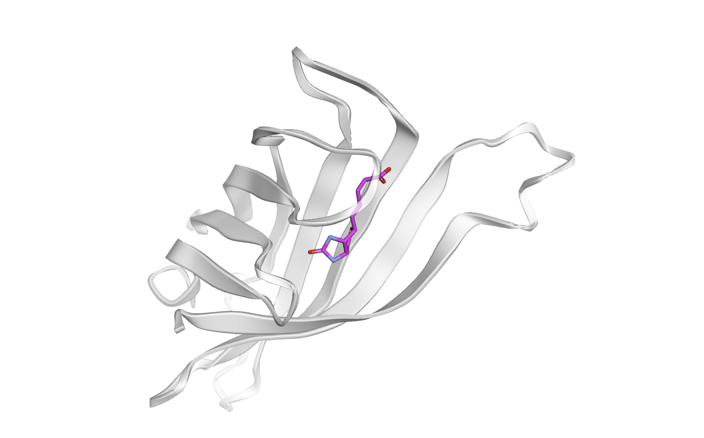

# DiffDock Scale Validation Pipeline

> An MLOps orchestrator for automating, configuring, and scaling molecular docking inference with [DiffDock-L](https://github.com/gcorso/DiffDock) — designed for local validation and HPC deployment (SLURM/CESGA).


---

## Overview

This project wraps DiffDock-L in a modular, reproducible orchestration layer that goes from raw `.pdb`/`.sdf` inputs to ranked docking poses and quantitative structural validation — with a single command locally, or a single `sbatch` submission on an HPC cluster.

The pipeline was designed with scale in mind from the start: the same orchestrator that runs 1 complex on a laptop can run N×M cross-docking jobs on a CESGA Finis Terrae III A100 node, without changing a single line of Python. Configuration is cleanly separated from code via `config.sh`, hardware selection (CPU/GPU, batch size, thread count) is runtime-configurable, and a `--dry_run` flag lets you validate the full orchestration logic — CSV generation, path resolution, command construction — without touching the inference engine.

The current validation case is the **streptavidin–biotin complex (PDB: 1STP)**, a structurally well-characterized benchmark with an unambiguous binding pocket.

---

## Repository Structure

```
diffdock-scale-validation/
│
├── core_pipeline/
│   └── run_pipeline.py        # Python orchestrator: input validation, CSV mapping, subprocess dispatch
│
├── data_analysis/
│   ├── proteins/
│   │   └── 1STP_clean.pdb     # Receptor structure (HETATM-stripped for blind docking)
│   └── ligands/
│       └── BTN_ideal.sdf      # Biotin ligand
│
├── results/                   # DiffDock output: one subfolder per complex, ranked .sdf poses
│
├── config.sh                  # Centralised configuration: paths, inference parameters
├── environment.yml            # Conda environment (Python 3.9, PyTorch 1.11, PyG, RDKit…)
├── run.sh                     # Local launcher: loads config.sh, activates env, runs pipeline
├── run_hpc.sbatch             # SLURM job script (CESGA FT3 A100, 32-core binding, CUDA guard)
├── install_env.sbatch         # Separate SLURM job for environment setup (CPU-only, no GPU waste)
└── result_analysis.ipynb      # End-to-end analysis: QA, confidence score plots, 3D viewer, RMSD
```

---

## Scientific Background

### The model: DiffDock-L

DiffDock treats molecular docking as a **generative diffusion process** over the product space of translational, rotational, and torsional degrees of freedom. Instead of scoring pre-generated poses (as classical methods do), it directly samples plausible binding structures through iterative denoising steps. DiffDock-L (2024) extends the original with improved generalization to unseen protein families.

### What the confidence score is — and isn't

DiffDock outputs a **confidence score** alongside each predicted pose. This is the output of a *separate* classifier trained to predict whether a given pose achieves heavy-atom RMSD < 2 Å versus the true crystallographic pose. Rough thresholds from the original paper:

| Score | Confidence |
|---|---|
| `c > 0` | High — structurally plausible pose |
| `−1.5 < c < 0` | Moderate |
| `c < −1.5` | Low — likely incorrect placement |

Two things the score is **not**:
- It is **not** a physical energy or thermodynamic quantity — it does not directly encode steric clashes, hydrogen-bond geometry, or solvation.
- It is **not** binding affinity (ΔG, K_d, K_i). A high confidence score means "this looks like a correctly docked structure," not "this ligand binds tightly." For affinity prediction, DiffDock poses should be post-processed with tools like GNINA or MM/GBSA.

### Validation case: streptavidin–biotin (1STP)

Streptavidin–biotin was selected as the validation case because it has one of the deepest, most geometrically unambiguous binding pockets in structural biology — well-suited for sanity-checking a new pipeline both visually and quantitatively.

**Honest caveat:** PDB entry 1STP was deposited in 1992. DiffDock's train/test split uses a temporal cutoff (≤2018 = training, ≥2019 = test). This complex is almost certainly part of the model's training data. The result here is therefore a **pipeline end-to-end validation**, not a generalization benchmark. Production studies should use complexes deposited after the model's cutoff date.

---

## Key Results

The pipeline successfully runs end-to-end on local CPU (reduced `--steps`/`--samples` for speed). The Rank-1 pose lands in the canonical streptavidin binding pocket, confirmed both visually and quantitatively.

| Metric | Value |
|---|---|
| Rank-1 confidence score | > 0 (high confidence tier) |
| Heavy-atom RMSD vs. crystal pose | < 2 Å ✓ (DiffDock paper criterion) |
| Complexes processed without QA failures | 1 / 1 |

*RMSD computed with `spyrmsd` (symmetry-corrected, no re-alignment — both structures share the protein coordinate frame). The reference pose is extracted from the original unmodified PDB deposition, with bond orders restored from a validated SMILES template.*



> *Figure 1. The binding pocket (cyan) and predicted ligand pose (magenta) are rendered interactively in `result_analysis.ipynb` using `py3Dmol`, with residues selected at the full-residue level within 5 Å of the ligand.*

---

## Installation

### Prerequisites

- Linux or WSL2
- [Miniforge](https://github.com/conda-forge/miniforge) or Anaconda

### Local setup

```bash
# 1. Clone this orchestrator
git clone https://github.com/nicolascoutop/diffdock-scale-validation.git
cd diffdock-scale-validation

# 2. Clone the DiffDock inference engine into the project root
git clone https://github.com/gcorso/DiffDock.git

# 3. Create and activate the environment
conda env create -f environment.yml
conda activate diffdock
```

---

## Usage

### Local run

Place `.pdb` files in `data_analysis/proteins/` and `.sdf`/`.smi` ligands in `data_analysis/ligands/`. Then:

```bash
conda activate diffdock
./run.sh
```

`run.sh` calls `source config.sh` internally — no need to source it manually beforehand.

Or call the orchestrator directly with full control over inference parameters and hardware:

```bash
python core_pipeline/run_pipeline.py \
    --steps 20 --samples 5 \
    --batch_size 4 --threads 8 \
    --device cpu          # or 'gpu'; omit for autodetection
```

### Validate orchestration without inference (dry run)

Builds the full inference command — CSV mapping, resolved paths, all flags — but does not invoke DiffDock. Useful for testing the pipeline on any machine, regardless of GPU or model checkpoint availability:

```bash
python core_pipeline/run_pipeline.py --dry_run
```

### HPC deployment (CESGA Finis Terrae III)

The environment setup and the inference job are intentionally split into two separate SLURM scripts. Conda dependency resolution is CPU-bound and can wait in the CPU queue (faster scheduling); the GPU A100 is only allocated when actually needed for inference.

```bash
# Step 1 — Set up the conda environment (CPU queue, exits when env is ready)
sbatch install_env.sbatch

# Step 2 — Run the pipeline (once install_env.sbatch completes successfully)
sbatch run_hpc.sbatch
```

`run_hpc.sbatch` enforces CESGA FT3 requirements (32 cores per A100, `$STORE`-rooted conda paths) and includes a CUDA availability guard at startup — the job aborts immediately with a clear message if the environment and driver are mismatched, rather than failing silently mid-inference.

### Analyse results

Open `result_analysis.ipynb` in JupyterLab or VS Code. The notebook:

1. Iterates over all subfolders in `results/` (scales to N complexes without code changes).
2. Reports QA status per complex — docking failures are flagged, not silently dropped.
3. Plots confidence score distributions per complex.
4. Renders an interactive 3D view of the top-ranked pose inside the binding pocket.
5. Computes symmetry-corrected RMSD against the crystallographic reference (where available).

Cells 1–4 are fully generic and require no changes for any protein–ligand pair. **Cell 5 (RMSD) is hardcoded for the biotin validation case** and must be updated to use a different complex. Three variables at the top of that cell need to be changed:

```python
REFERENCE_PDB_ID    = "1STP"                             # RCSB ID of the co-crystal structure
LIGAND_RESIDUE_NAME = "BTN"                              # 3-letter PDB HETATM code of the ligand
BIOTIN_SMILES       = "O=C(O)CCCC[C@@H]1SC[C@@H]2NC(=O)N[C@H]12"  # SMILES for bond-order restoration
```

Set `REFERENCE_PDB_ID = None` to skip the RMSD check entirely for complexes with no deposited crystal structure.

---

## Pipeline Architecture

```
config.sh  ──────────────────────────────────────────────────────────┐
                                                                      ▼
data_analysis/proteins/*.pdb ──┐                          ┌─────────────────────┐
data_analysis/ligands/*.sdf  ──┤──► run_pipeline.py  ──► │  inference_map.csv  │
                               │         │                └─────────────────────┘
                               │    [--dry_run]                       │
                               │    stops here                        ▼
                               │                         DiffDock inference.py
                               │                         (subprocess, isolated env)
                               │                                      │
                               └──────────────────────────────────────▼
                                                          results/{complex}/
                                                          rank1_confidence{c}.sdf
                                                          rank2_confidence{c}.sdf
                                                          ...
                                                                      │
                                                                      ▼
                                                        result_analysis.ipynb
                                                        (QA + plots + 3D + RMSD)
```

**Key design decisions:**

- `config.sh` uses `${VAR:-default}` syntax — environment variables set upstream (e.g. by a SLURM job script or CI pipeline) take precedence over defaults. No hardcoded paths in Python.
- `sys.executable` (not `"python"`) ensures the subprocess runs in the same conda environment as the orchestrator.
- Device control via `CUDA_VISIBLE_DEVICES` in the child process environment — not via a non-existent `--device` flag in `inference.py`. CPU is forced by setting `CUDA_VISIBLE_DEVICES=""` in the subprocess env; GPU mode leaves the variable untouched so SLURM's own binding is respected.
- Thread limits (`OMP_NUM_THREADS`, `MKL_NUM_THREADS`) are injected into the child process environment — they have no effect if set in the parent.

---

## Future Work

- **Multi-complex benchmarking:** run systematic cross-docking across a curated set of PDBBind 2019+ complexes to measure the pipeline's throughput and DiffDock-L's pose accuracy on structures outside its training distribution.
- **SLURM job arrays:** parallelise across complexes using `#SBATCH --array`, with one task per protein–ligand pair, to exploit the full parallelism of FT3's GPU nodes.
- **Comparison with classical methods:** benchmark DiffDock-L pose quality (RMSD, success rate) against AutoDock-Vina and Glide on the same input set, as stated in the repository description.
- **Post-docking affinity scoring:** integrate GNINA or MM/GBSA rescoring on top of DiffDock poses to move from structural confidence to binding affinity estimates.

---

## Citation

If you use DiffDock or DiffDock-L in your work, please cite the original authors:

```bibtex
@inproceedings{corso2023diffdock,
    title={DiffDock: Diffusion Steps, Twists, and Turns for Molecular Docking},
    author={Corso, Gabriele and Stärk, Hannes and Jing, Bowen and Barzilay, Regina and Jaakkola, Tommi},
    booktitle={ICLR},
    year={2023}
}

@inproceedings{corso2024discovery,
    title={Deep Confident Steps to New Pockets: Strategies for Docking Generalization},
    author={Corso, Gabriele and Deng, Arthur and Polizzi, Nicholas and Barzilay, Regina and Jaakkola, Tommi},
    booktitle={ICLR},
    year={2024}
}
```

---

## License

MIT — see [`LICENSE`](LICENSE).